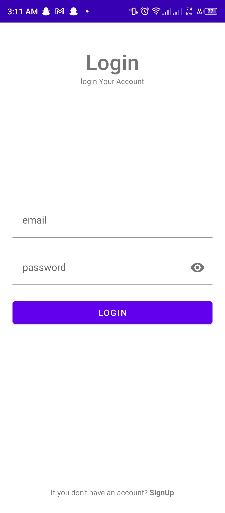
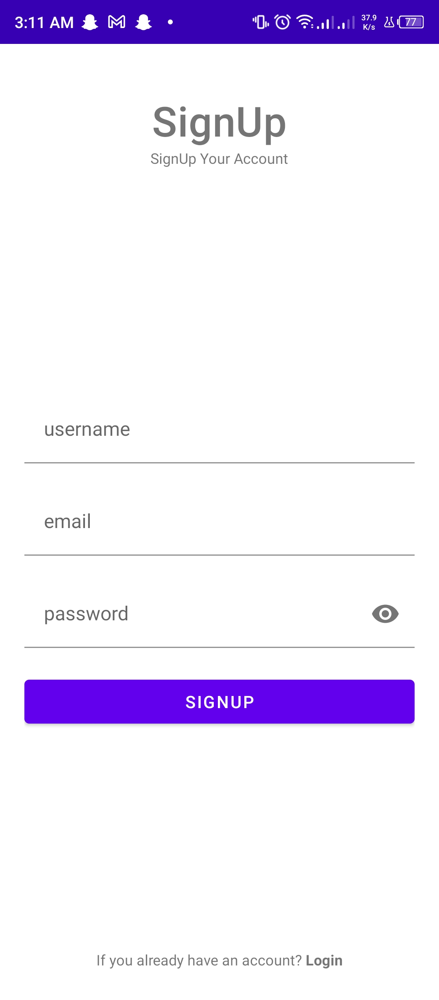
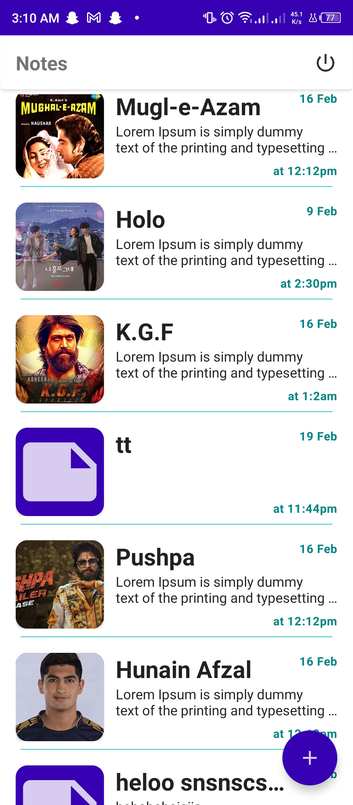
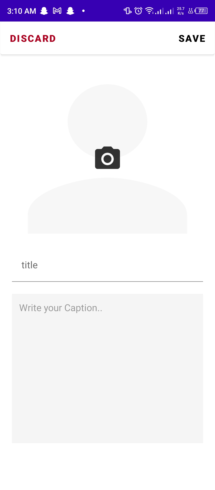

# -Notee
kotlin app with firebase implementation to save notes on to the cloud  
 
---- What you learn from this project ---  
->create android app using kotlin  
->create modern user interface  
->Recycler view implementation most simplest way  
->Firebase auth  
->Get/Add/Update/delete data from firebase firestore  
->add images into the firebase storage  
  
--- App ScreenShots ---  

